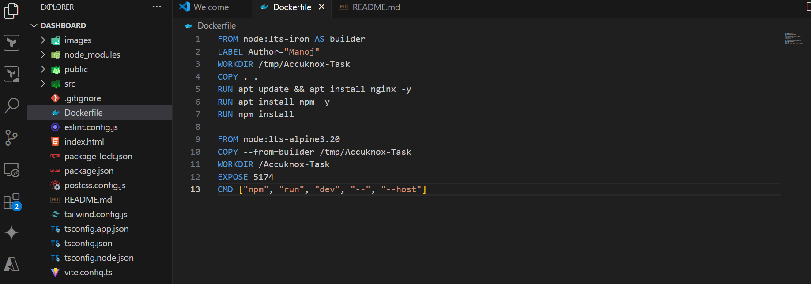
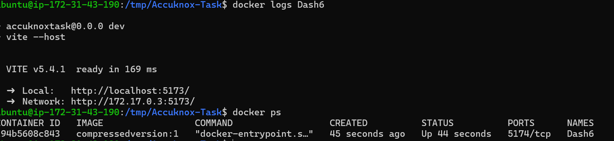
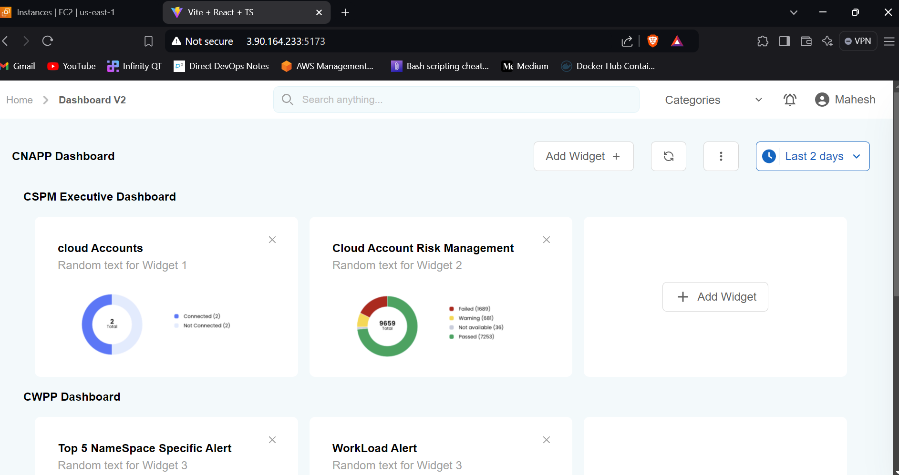

# AccuKnox Dashboard Task

This repository contains a dashboard application built using React.js. The application is containerized using Docker and served through Nginx. It allows users to create and manage dashboards easily. This project is useful for creating interactive and visually appealing dashboards.

## Features
- React.js front-end
- Dockerized application
- Served using Nginx
- Easy to deploy on any platform
- Supports live reloading via Vite
- Minimal setup required for development and production environments

## Prerequisites
Make sure you have the following installed on your system:
- Docker
- Docker Compose (optional, for multi-container environments)
- Node.js (for local development)

## Installation

### Local Development

1. Clone the repository:
   ```bash
   git clone https://github.com/your-username/accuknox-dashboard.git
   cd accuknox-dashboard
   ```

2. Install the dependencies:
   ```bash
   npm install
   ```

3. Start the development server:
   ```bash
   npm run dev
   to expose network 
   npm run dev -- --host
   ```

4. Open your browser and navigate to `http://localhost:5174` to view the dashboard.

### Docker Setup

This project is containerized for easy deployment using Docker.

1. **Build the Docker image**:
   ```bash
   docker build -t accuknox-dashboard .
   ```

2. **Run the Docker container**:
   ```bash
   docker run -p 5174:5174 accuknox-dashboard
   ```

3. The application will be accessible on `http://localhost:5174`.

### Dockerfile Overview

The `Dockerfile` is structured using multi-stage builds to optimize the final image size:
- **Builder Stage**: Installs dependencies, builds the application, and prepares everything needed to run it.
- **Final Stage**: Runs the application using a lightweight Node.js image.

```Dockerfile
FROM node:18 AS builder
LABEL Author="Manoj"
WORKDIR /tmp/Accuknox-Task
COPY . .
RUN apt update && apt install nginx -y
RUN apt install npm -y
RUN npm install

FROM node:18-alpine
COPY --from=builder /tmp/Accuknox-Task /Accuknox-Task
WORKDIR /Accuknox-Task
EXPOSE 5173
CMD ["npm", "run", "dev", "--", "--host", "0.0.0.0"]
```

### Multi-Stage Build Explanation
1. The first stage (`builder`) is responsible for installing all dependencies (`nginx`, `npm`, and the project's dependencies).
2. The second stage copies the built application from the first stage and runs it in a smaller, production-friendly container.

### Nginx Setup

Nginx is installed as part of the Docker build process and serves static files efficiently. This setup makes it easy to extend the project for production by modifying the Nginx configuration file and serving the built React application instead of relying on the development server.

### Environment Variables

You can define environment variables in a `.env` file for different configurations.

### Customization

To customize this project:
1. Modify the React.js code in the `src/` folder to suit your needs.
2. Adjust the `vite.config.ts` file for any custom build options.
3. Update the Nginx configuration in the Dockerfile if you need specific server-side settings.

## Contributing

We welcome contributions! Feel free to fork the repository and submit pull requests to improve the dashboard.

### Explanation:
- **Features**: Highlights the main features of the application.
- **Installation**: Guides users through setting up the application locally and using Docker.
- **Dockerfile Overview**: Provides insights into how the Dockerfile is structured, particularly the multi-stage build.
- **Nginx Setup**: Mentions Nginx usage, leaving room for future production optimizations.
- **Customization**: Explains how users can modify the project to fit their needs.




